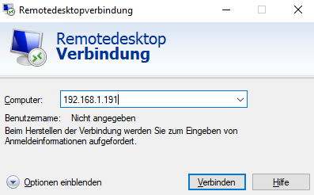
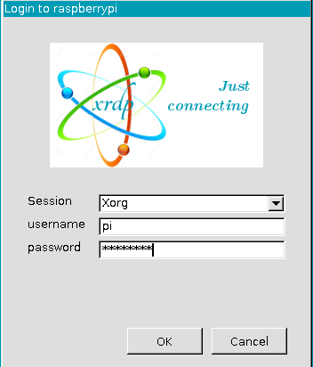
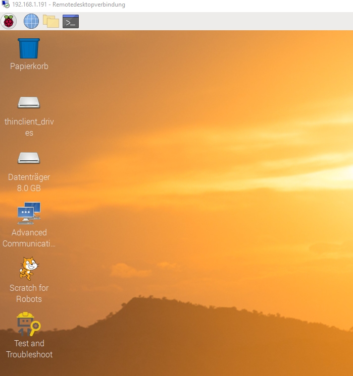

# Raspberry Pi Remote Desktop Connection 
## Einführung
Ich werde auf meinem PC eine RDP-verbindung aufbauen zum Raspberry. Dazu mache ich noch ein Video, wie das Verbinden über RDP funktioniert. Eine Anleitung werde ich erstellen, damit man es jederzeit nachbauen kann. 

---  
## Anleitung Commandline
Man öffnet das Terminal auf dem Raspberry Pi und gibt als aller erstes diesen Befehl ein, damit die Software des Raspberry Pi auf dem neusten Stand ist. 

`Sudo apt-get upgrade`

Als nächstes geben wir zwei weitere Befehle ein, damit wir später von unseren Desktop-Computer auf dem Raspberry über RDP zugreifen können. 

`Sudo apt-get install xrdp`

`Sudo apt-get install tightvncserver`

Jetzt müssen wir noch die IP-Adresse herausfinden vom Raspberry Pi, dazu geben wir folgenden Befehl ein: 

`ifconfig`

Dann öffnen die auf dem Desktop-Computer die Remotedesktopverbindung und gibt die IP-Adresse ein und klickt auf Verbinden. 

Sobald wir auf Verbinden geklickt haben, kommt das Anmeldefenster vom Raspberry Pi, dort Loggen wir und mit dem Username und Passwort ein und bestätigt es mit „OK“.

Jetzt sieht man das wir eine RDP-Verbindung aufgebaut haben und es funktioniert. 

---  
## Fachbegriffe  
> **RDP-Verbindung**  
> Kurz für *Remote Desktop Protocol-Verbindung*.  
> Mit dieser Verbindung, kann man auf einen externen Computer zugreifen.  
> Ein Beispiel dafür wäre Teamviewer.