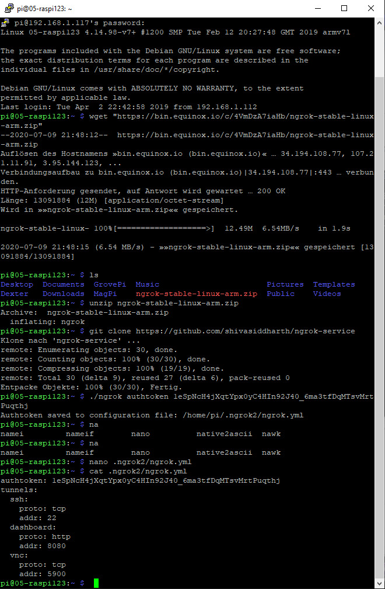
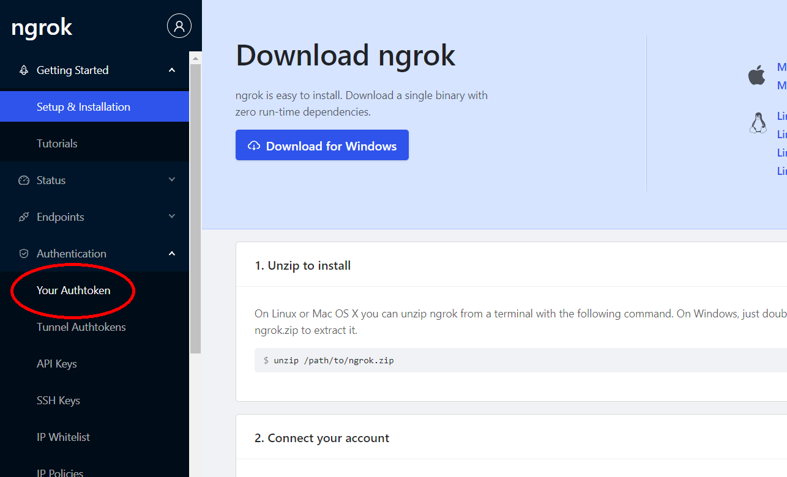
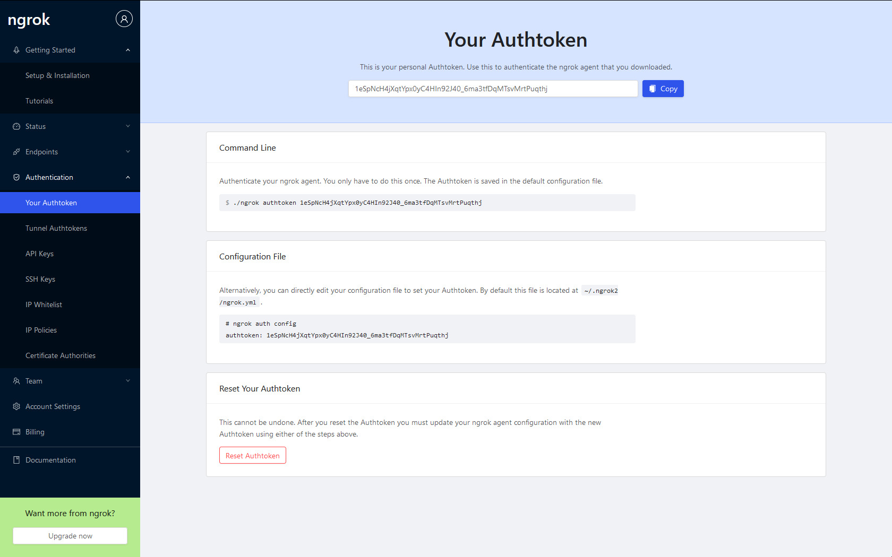
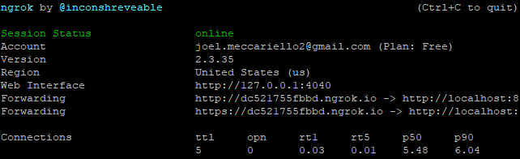
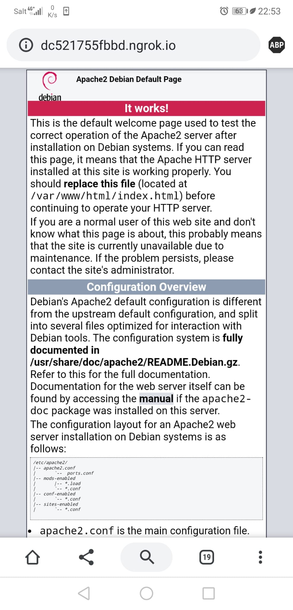
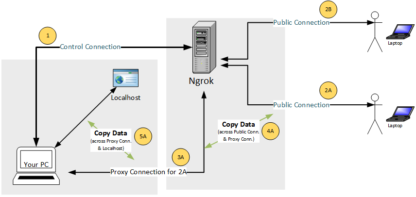

# W01 Web Tunneln  
## Ablauf
  
Man nehme sein prefferiertes SSH Programm und gibt die IP Adresse des RaspberryPI ein. Wenn man sich verbunden hat, muss man sich mit dem vorgegebenen Benutzernamen und Passwort anmelden. Anschliessend muss man mit dem Befehl `wget "https://bin.equinox.io/c/4VmDzA7iaHb/ngrok-stable-linux-arm.zip"` die gezippte Installationsdatei herunterladen. Mit dem Befehl `ls` kann man dann überprüfen, ob der Download funktioniert hat.  
Entzippen kann man die Datei dann mit `unzip ngrok-stable-linux-arm.zip`.  
Um die Konfiguration später einfacher zu gestalten, kann man optional mit `git clone https://github.com/shivasiddharth/ngrok-service` eine Vorlage für die Konfigurationsdatei herunterladen.  
Als nächstes sollte man sich einen Account auf https://dashboard.ngrok.com/signup machen, um einen Authentifizierungstoken zu erhalten.  
  
  
Da man jetzt im Besitz eines Authentifizierungtoken ist, kann man mit dem Befehl `./ngrok authtoken [DEIN TOKEN]` den Token zu ngrok hinzufügen.  
Falls man die Vorlage für die Konfigurationsdatei heruntergeladen hat, kann man diese anzeigen lassen mit `cat ngrok-service/ngrok-sample.yml`. Diese Vorlage kann man mit seinem Token ergänzen und die ngrok Konfigurationsdatei damit überschreiben. Am einfachsten geht dies mit dem nano editor.  
Nun kann man den HTTP Tunnel von ngrok starten mit dem Befehl `./ngrok http 80`.  
  
Wenn man bis jetzt alles richtig gemacht hat, findet man unter "Forwarding" eine HTTP URL. Diese URL kann man kopieren und dann auf einem Mobilgerät über eine Mobiledatenverbindung öffnen. Man sollte dann diesen Screen sehen:  
  

---  
## Diagramm  
  
1. Mit dem eigenen PC kann man ngrok Kontrollieren und Konfigurieren.  
2. Ngrok hat zudem noch eine öffentliche read-only Verbindung, über die andere Benutzer zugreifen können.  
3. Ngrok erstellt dann eine sichere Proxy-Verbindung zu dem eigenen PC, welche andere Benutzer benutzen, um die lokalen Dateien sehen zu können.  
4. Über die Proxy-Verbindung werden dann die lokalen Dateien kopiert und den Endbenutzern gesendet.  
5. Ngrok holt sich die lokalen Dateien über die Proxy-Verbindung, welche zum localhost des eigenen PCs verbindet.  

---  
## Fachbegriffe
> **Authentifizierungstoken**  
> Eine alphanumerische Kombination, welche benutzt wird, um einen Benutzer zu authentifizieren.  

  
> **Forwarding**  
> Ist eine art Referenz von einem Link zu einem anderen. Wird hier gebraucht um den richtigen ngrok Client anzusprechen.  

  
> **HTTP**  
> Kurz für *Hypertext transfer protocol*.  
> Wird für jegliche art von HTML-Datenübertragung verwendet.  

  
> **IP-Adresse**  
> Kurz für *Internet protocol*.  
> Wird aus 4x8bit (mit Punkten getrennt) gebildet.
> Wird zur Identifikation eines internetfähigen Gerätes innerhalb eines Netzwerks verwendet.  

  
> **Localhost**  
> Der localhost ist eine art lokale Webseite jedes PCs, welcher ein Webserver betreibt.  
> Hier wird extern auf den localhost zugegriffen.

  
> **ngrok**  
> Ist ein Programm, welches die externe Kommunikation mit dem localhost ermöglicht.  

  
> **Proxy-Verbindung**  
> Ist eine art Mittelmann für Verbindungen.  
> Diese können mit dem Proxy verschlüsselt werden.  

  
> **SSH**  
> Kurz für *Secure Shell*.  
> Wird benutzt um über die IP-Adresse auf einen Externen Rechner zuzugreifen.  

  
> **Tunneling**  
> Mit tunneling kann man die Firewall umgehen und somit lokale Dateien auch extern verwenden.  

  
> **URL**  
> Kurz für *Uniform Ressource Locator*.  
> Ist eine art Referenz zu einer Ressource.  
> Wird gebraucht um redundanz zu vermeiden und somit nicht immer die referierte Datei zu schicken.