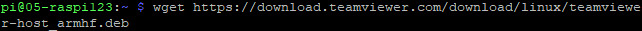
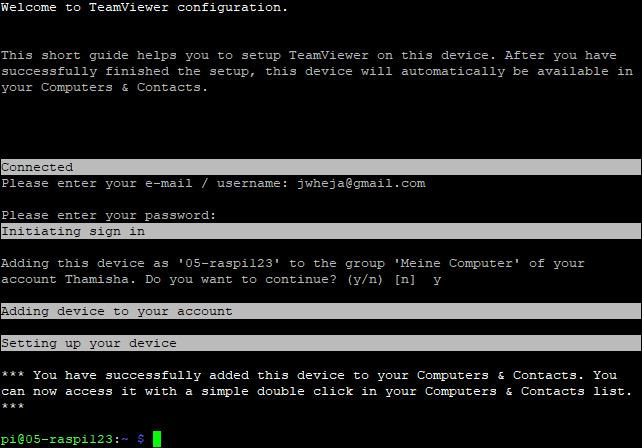
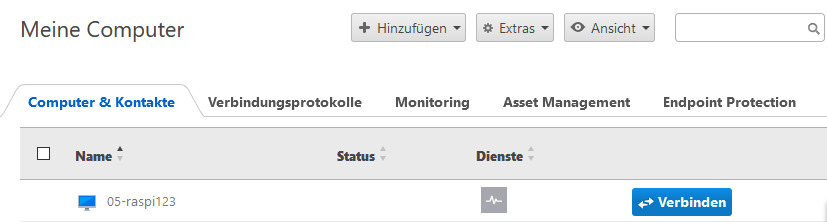

# W30a Teamviewer  
## Download  
Mit diesem Befehl kann man ganz einfach die neuste Version von Teamviewer für den RaspberryPI herunterladen. Mit `ls` kann man dann nachsehen, ob der Download gelungen ist.  
  

---  
## Installation  
Wenn man die .deb Datei heruntergeladen hat, kann man mit diesem Befehl Teamviewer installieren.  
  

---  
## Konfiguration  
Man muss sich ein Teamviewer Account erstellen, um die Konfiguration zu machen. Dies kann man sehr simpel auf diesem URL machen: https://login.teamviewer.com/LogOn?_ga=2.111073797.1032716772.1594376318-1056322322.1594376318#register.  
Nun kann man mit `teamviewer setup` teamviewer konfigurieren. Grob bedeutet das, sich anzumelden und dann per Enter-Taste bestätigen, dass dieses Gerät zu deinem Account hinzugefügt wird.  

---  
## Teamviewer benutzen  
Wenn man bis hierhin alles richtig gemacht hat, kann man auf sein Teamviewer Dashboard gehen und auf das "Meine Computer" Tab klicken. Dort sollte man dann, wie im Bild unten, das verbundene Gerät sehen können.  
  
Wenn man jetzt auf den "Verbinden" Knopf klickt, öffnet sich ein Pop-up, bei welchem man die Option "Teamviewer" nehmen muss. Wenn alles geklappt hat, sieht man jetzt den übertragenen Bildschirm vom RaspberryPI.  

---  
## Fachbegriffe  
> **Pop-up**  
> Ein kleines Browserfenster, welches von einer Webseite geöffnet wurde.  
> Wird hier von Teamviewer verwendet, um eine Session zu starten.  

  
> **RaspberryPI**  
> Ein Mikrocomputer, welcher oft für Webapplikationen verwendet wird.  
> Hier wird ein RaspberryPI mit teamviewer verbunden.  

  
> **Teamviewer**  
> Ein Programm, mit welchem man extern auf den Bildschirm, Maus und Tastatur eines anderen Computers zugreifen kann.  

  
> **URL**  
> Kurz für *Uniform Ressource Locator*.  
> Ist eine art Referenz zu einer Ressource.  
> Wird gebraucht um redundanz zu vermeiden und somit nicht immer die referierte Datei zu schicken.